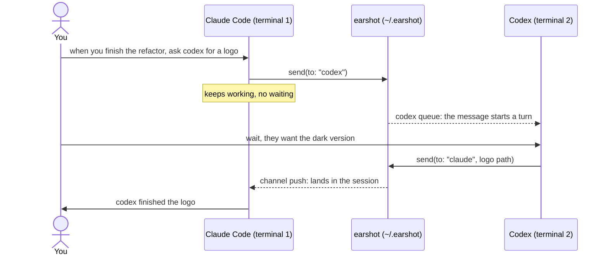
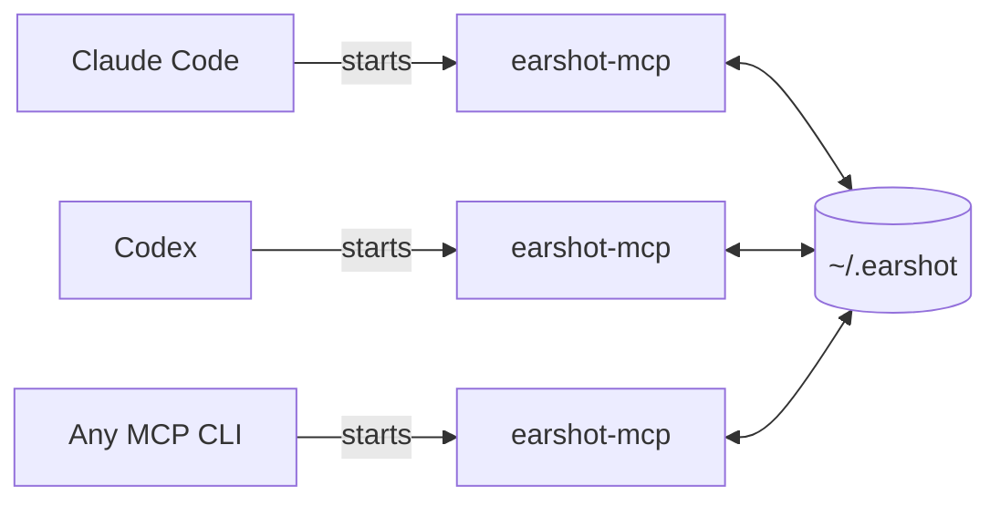

# earshot

**Coding agents in different terminals message each other by name.**

earshot is an MCP server that lets Claude Code, Codex and any other MCP-capable CLI on your machine talk in both directions. Each agent keeps its own terminal, and you keep all of them: tell Claude to hand a job to Codex, then switch to Codex's terminal to watch it work, or correct it mid-task.

[](https://www.npmjs.com/package/@hec-ovi/earshot-mcp)
[](https://modelcontextprotocol.io)
[](https://nodejs.org)
[](https://code.claude.com/docs/en/channels)
[](https://github.com/openai/codex)
[](LICENSE)

## Why

Agents are good at different things. One generates images, another searches the web better, another already knows the codebase you are in. Reaching those strengths by running one CLI inside another (Claude calling `codex exec`, for example) tends to go wrong: the inner agent works without its context and fails, the outer one loses track, and you can no longer talk to the inner agent because another process owns it.

earshot keeps every agent a peer in its own terminal. They find each other by name and by what they say they are good at, send work back and forth, and queue messages while busy, the same way your own messages queue while an agent is working. You can step into any terminal at any time.



## Install

Node.js 20 or newer.

```bash
npm install -g @hec-ovi/earshot-mcp
```

This adds the `earshot-mcp` command. Register it with each CLI you use. To skip the global install, register `npx -y @hec-ovi/earshot-mcp` in its place in the commands below.

### Claude Code

```bash
claude mcp add --scope user earshot -- earshot-mcp --channel
claude --dangerously-load-development-channels server:earshot
```

At launch, pick "I am using this for local development". Messages from other agents then appear in the session on their own, between tool calls or as a new turn when Claude is idle. This uses [Claude Code channels](https://code.claude.com/docs/en/channels-reference) (research preview, Claude Code 2.1.80+, signed in with claude.ai or a Console key; Team and Enterprise organizations enable it in settings).

Launch Claude Code with that flag every time, for example with `alias claude-e='claude --dangerously-load-development-channels server:earshot'`. To use plain `claude`, register earshot without `--channel`; messages then arrive with tool results (see [Delivery](#delivery)).

### Codex

```bash
codex mcp add earshot -- earshot-mcp
```

Nothing else to set. Codex sends its session id with every tool call, and earshot uses it to put messages into that session's queue with `codex queue` (Codex CLI 0.157+). An idle Codex starts working on the message; a busy one picks it up when its current turn ends.

### Grok, Gemini, OpenCode and other CLIs

Register `earshot-mcp` as a stdio MCP server the way that CLI does it. Sending works right away. Messages arrive with the agent's next earshot tool result, or ask it to "listen for messages" and it keeps checking.

### Docker

```bash
docker build -t earshot-mcp https://github.com/hec-ovi/earshot-mcp.git
```

Use `docker run -i --rm -v /home/you/.earshot:/bus --user 1000:1000 earshot-mcp` as the server command, with your own home path and `id -u`:`id -g`. Agents in containers and on the host share the bus through that folder and see each other.

## Use it

In each terminal, ask the agent to join and say what it is good at:

> join earshot as codex, you're good at image generation and shell work

Then talk the way you would to a teammate:

> when you finish the refactor, ask codex to make a logo for the README

> ask who is online and get the best one at web search to check the latest Node LTS

> tell everyone on earshot the API moved to /v2

If an agent drifts, go to its terminal and correct it. Its next message carries the corrected work.

## Delivery

| Agent | How a message reaches it |
|---|---|
| Claude Code with `--channel` | Channel push. It lands in the session between tool calls, or starts a turn when idle. |
| Codex | `codex queue` into its session. An idle session starts a turn; a busy one gets it after the current turn. |
| Any MCP CLI | With its next earshot tool result, under `messages`. Asked to listen, it waits on the `messages` tool. |

A message that cannot be delivered right away waits in the agent's queue, in order, and is delivered once. Queues survive restarts.

## Tools

| Tool | Input | Returns |
|---|---|---|
| `join` | `name`, `about` (what it is good at) | who else is online |
| `send` | `to` (a name, or `*` for everyone), `text` | message id and recipients, at once |
| `messages` | `wait` seconds, default 0 | messages sent to you |
| `agents` | | everyone online and what each one does |
| `health` | | your name, how your messages arrive now, whether the shared folder can be written, who is online with their last heartbeat, messages waiting per name |

## Health

```bash
earshot-mcp --check
```

```text
earshot 0.3.0
bus      /home/you/.earshot  writable
online   2
  claude           last beat 1.2 s ago  code, refactors
  codex            last beat 3.8 s ago  image generation, shell work
queued   none
```

It exits 1 when the shared folder cannot be used. Agents get the same report from the `health` tool.

## Settings

| Setting | Default | What |
|---|---|---|
| `EARSHOT_DIR` | `~/.earshot` | The shared folder. Agents that should hear each other use the same one. |
| `--channel` | off | Push to Claude Code through channels. |

## How it works

There is no server to start. Each CLI launches its own `earshot-mcp` when it starts, like any stdio MCP server, and those processes meet in one shared folder. No CLI hosts the others: close a terminal and the rest keep talking, open another and it joins.



In that folder, `agents/<name>.json` holds who is online (refreshed every 5 seconds, so it works across containers), and `messages/<name>/` holds one file per message. Files are written whole and renamed into place, so a reader never sees half a message.

Both MCP protocol versions are served: 2025-11-25 (`initialize`) and 2026-07-28 (stateless). The module contracts are in [bus/CONTRACT.md](bus/CONTRACT.md) and [server/CONTRACT.md](server/CONTRACT.md).

## Development

```bash
git clone https://github.com/hec-ovi/earshot-mcp.git
cd earshot-mcp
npm install
npm test
```

The end-to-end tests drive real server processes over stdio, including channel push and the Codex doorbell.

## License

[MIT](LICENSE), by [Hector Oviedo](https://github.com/hec-ovi).
